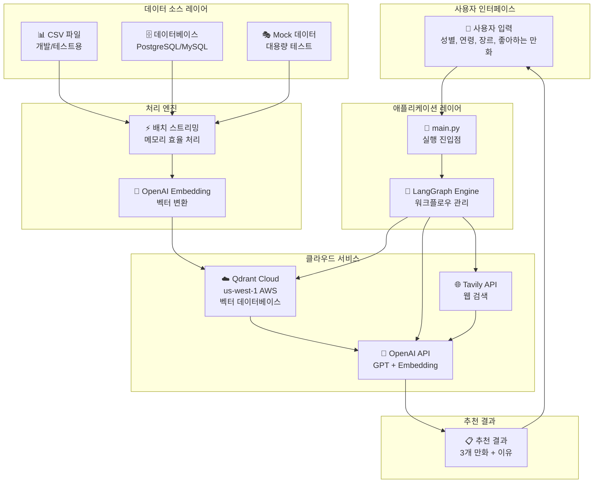
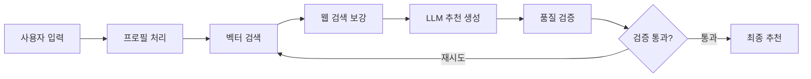

# Manga Recommendation System

만화 추천 시스템은 사용자의 선호도를 기반으로 개인화된 만화 추천을 제공하는 AI 시스템입니다.

## 🚀 빠른 시작

### Docker 방식 (권장 - 개발용)

```bash
# 1. Qdrant 시작
docker-compose up -d

# 2. 환경 변수 설정 (.env 파일)
echo "OPENAI_API_KEY=your_openai_api_key_here" > .env
echo "TAVILY_API_KEY=your_tavily_api_key_here" >> .env  # 웹 검색용

# 3. 의존성 설치 (uv 사용)
uv sync

# 4. 실행
python main.py
```

### 클라우드 방식 (상용 환경)

```bash
# 1. 환경 변수 설정 (.env 파일)
echo "OPENAI_API_KEY=your_openai_api_key_here" > .env
echo "TAVILY_API_KEY=your_tavily_api_key_here" >> .env
echo "QDRANT_URL=https://your-cluster.qdrant.io" >> .env
echo "QDRANT_API_KEY=your_api_key_here" >> .env

# 2. 의존성 설치
uv sync

# 3. 실행
python main.py
```

## 🛠️ 환경 설정

### 필수 요구사항
- Python 3.13+
- Docker (로컬 개발 시)
- OpenAI API 키
- Tavily API 키 (웹 검색 기능)

### 1. Qdrant 벡터 저장소 설정

#### 🐳 Docker 방식 (로컬 개발용)

```bash
# Qdrant 컨테이너 시작
docker-compose up -d

# 컨테이너 상태 확인
docker-compose ps

# Qdrant 웹 UI 접속
# http://localhost:6333/dashboard
```

#### ☁️ 클라우드 방식 (상용 환경용)

1. [Qdrant Cloud](https://cloud.qdrant.io/)에서 새 클러스터 생성
2. API 키 발급
3. `.env` 파일에 URL과 API 키 설정

### 2. Python 환경 설정

```bash
# uv 설치 (아직 없다면)
pip install uv

# 의존성 설치
uv sync
```

### 3. 환경 변수 설정

`.env` 파일 생성:

```bash
# 필수
OPENAI_API_KEY=your_openai_api_key_here
TAVILY_API_KEY=your_tavily_api_key_here

# 클라우드 Qdrant 사용 시 추가
QDRANT_URL=https://your-cluster-id.qdrant.io
QDRANT_API_KEY=your_qdrant_api_key_here
```

## 🏗️ 시스템 아키텍처


### 핵심 컴포넌트

```
📁 manga-recommendation/
├── 🎯 main.py                          # 메인 실행 파일
├── 🧠 manga_recommendation_langgraph.py # LangGraph 기반 추천 로직
├── 📊 data_source.py                   # 데이터 소스 추상화
├── 🔍 vector_store.py                  # Qdrant 벡터 저장소
├── 📝 prompt_templates.py              # LLM 프롬프트 템플릿
├── 🎭 domain.py                        # 도메인 모델 (Demographic)
└── 📄 README.md                        # 프로젝트 문서
```

### 추천 워크플로우



## 📊 사용 예시

### 기본 사용법

```python
import asyncio
from data_source import CSVMangaDataSource
from manga_recommendation_langgraph import create_recommendation_graph

# 사용자 입력
user_input = {
    "gender": "female",              # "male", "female", "skip"
    "age": "18~30",                 # "12~15", "15~18", "18~30", "30~40", "40~50", "50~"
    "genres": ["Romance", "Drama"],  # 선호 장르 리스트
    "favorite_manga": "목소리를 못 내는 소녀는"  # 좋아하는 만화 제목
}

# 데이터 소스 설정
csv_source = CSVMangaDataSource("manga_rows.csv")

# 추천 그래프 생성 및 실행
app = create_recommendation_graph(csv_source)

# 초기 상태 설정
initial_state = {
    "user_gender": user_input['gender'],
    "user_age_group": user_input['age'],
    "user_genres": user_input['genres'],
    "user_favorite_manga": user_input['favorite_manga'],
    "favorite_manga_docs": [],
    "search_results": [],
    "search_attempt": 0,
    "recommendations": [],
    "recommendation_quality": 0.0,
    "needs_refinement": False,
    "validation_log": []
}

# 실행
async def run():
    final_state = await app.ainvoke(initial_state, config={"recursion_limit": 10})
    return final_state

# 결과 출력
result = asyncio.run(run())
```

## 🔧 주요 기능

### 1. 다중 데이터 소스 지원

```python
# CSV 파일
csv_source = CSVMangaDataSource("manga_data.csv")

# 대용량 테스트 (모킹)
mock_source = MockDatabaseMangaDataSource(record_count=1000000)

# 실제 데이터베이스 (구현 필요)
db_config = {
    "host": "localhost",
    "database": "manga_db",
    "user": "user",
    "password": "password"
}
db_source = DatabaseMangaDataSource(db_config)
```

### 2. 벡터 검색 전략

- **중심점 임베딩**: 좋아하는 만화들의 임베딩 평균값으로 검색
- **개별 검색 후 병합**: 각 만화별로 검색 후 점수 집계

### 3. 웹 검색 보강

Tavily API를 통해 실시간 만화 정보 수집:
- 좋아하는 만화의 특징 검색
- 후보 만화들의 리뷰 정보 수집

### 4. 품질 검증

- 추천 개수 검증 (정확히 3개)
- LLM 기반 품질 평가 (75점 이상)
- 자동 재시도 메커니즘

## 📈 성능 최적화

### 메모리 효율적 배치 처리

```python
# 대용량 데이터 스트리밍
for batch in data_source.load_manga_data_batches(batch_size=5000):
    vector_store.index_manga_batch(batch)
    del batch  # 메모리 해제
```

### 벡터 DB 인덱싱

- 배치 크기: 100개 단위
- 병렬 처리 가능
- 중복 인덱싱 방지

## 🆚 Docker vs 클라우드 Qdrant

| 구분 | 🐳 Docker | ☁️ 클라우드 |
|------|-----------|-------------|
| **설정** | 간단 | API 키 필요 |
| **비용** | 무료 | 유료 |
| **성능** | 로컬 속도 | 네트워크 지연 |
| **확장성** | 제한적 | 자동 확장 |
| **백업** | 수동 | 자동 |
| **권장 환경** | 개발/테스트 | 프로덕션 |

## 🔍 디버깅

### 벡터 DB 내용 확인

```python
# vector_store.py의 디버깅 메서드 사용
vector_store = QdrantMangaStore()
vector_store.debug_vector_db_contents(limit=10)
```

### 로그 레벨 설정

```python
import logging
logging.basicConfig(level=logging.INFO)
```

## 📝 데이터 형식

### CSV 파일 필수 컬럼

- `id`: 만화 고유 ID (정수)
- `title`: 만화 제목
- `title_english`: 영문 제목
- `title_japanese`: 일본어 제목
- `genres`: 장르 (JSON 배열)
- `themes`: 테마 (JSON 배열)
- `demographics`: 대상 독자층 (JSON 배열)
- `authors`: 작가 (JSON 배열)
- `synopsis`: 줄거리
- `status`: 연재 상태
- `published`: 출간 정보 (JSON)
- `images`: 이미지 정보 (JSON)

### 사용자 입력 형식

```python
{
    "gender": "male" | "female" | "skip",
    "age": "12~15" | "15~18" | "18~30" | "30~40" | "40~50" | "50~",
    "genres": ["Action", "Romance", ...],  # 선호 장르 리스트
    "favorite_manga": "만화 제목"          # 좋아하는 만화 (단수)
}
```

## 🚨 주의사항

1. **API 키 보안**: `.env` 파일을 절대 커밋하지 마세요
2. **대용량 데이터**: 메모리 사용량 모니터링 필요
3. **비용 관리**: OpenAI와 Tavily API 사용량 확인
4. **인덱싱 시간**: 대용량 데이터는 초기 인덱싱에 시간 소요

## 📚 참고 자료

- [LangGraph 문서](https://python.langchain.com/docs/langgraph)
- [Qdrant 문서](https://qdrant.tech/documentation/)
- [OpenAI Embeddings](https://platform.openai.com/docs/guides/embeddings)
- [Tavily API](https://docs.tavily.com/)

## 🤝 기여 방법

1. Fork the repository
2. Create your feature branch (`git checkout -b feature/AmazingFeature`)
3. Commit your changes (`git commit -m 'Add some AmazingFeature'`)
4. Push to the branch (`git push origin feature/AmazingFeature`)
5. Open a Pull Request

## 📄 라이선스

이 프로젝트는 MIT 라이선스 하에 배포됩니다.