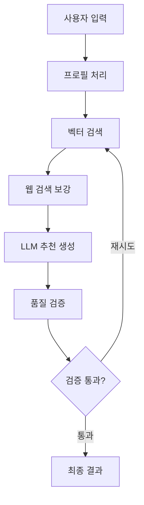

# Manga Recommendation System

만화 추천 시스템은 사용자의 선호도를 기반으로 개인화된 만화 추천을 제공하는 AI 시스템입니다.

## 🛠️ 환경 설정

### 1. Qdrant 벡터 저장소 설정

이 프로젝트는 벡터 저장소로 Qdrant를 사용합니다. Docker Compose를 사용하여 쉽게 설정할 수 있습니다.

```bash
# Qdrant 컨테이너 시작
docker-compose up -d

# 컨테이너 상태 확인
docker-compose ps

# Qdrant 웹 UI 접속 (선택사항)
# http://localhost:6333/dashboard
```

### 2. Python 환경 설정

**Python 3.13 이상이 필요합니다.**

```bash
# uv를 사용한 의존성 설치 (권장)
uv sync

# 또는 pip 사용
pip install -e .
```

### 3. 환경 변수 설정

`.env` 파일을 생성하고 다음 환경 변수를 설정하세요:

```bash
# OpenAI API 키 (필수)
OPENAI_API_KEY=your_openai_api_key_here

# Tavily API 키 (웹 검색용, 선택사항)
TAVILY_API_KEY=your_tavily_api_key_here
```

## 🚀 실행 방법

### 기본 실행

```bash
# 메인 추천 시스템 실행
python main.py
```

### 개발/테스트 환경

```bash
# Qdrant 시작
docker-compose up -d

# 프로그램 실행
python main.py

# 작업 완료 후 Qdrant 중지
docker-compose down
```

## 📦 Docker 관리 명령어

```bash
# Qdrant 시작 (백그라운드)
docker-compose up -d

# Qdrant 중지
docker-compose down

# Qdrant 데이터와 함께 완전 삭제
docker-compose down -v

# 컨테이너 로그 확인
docker-compose logs qdrant

# Qdrant 재시작
docker-compose restart qdrant
```

## 🔧 Qdrant 설정 정보

- **HTTP API 포트**: 6333
- **gRPC 포트**: 6334 (선택사항)
- **웹 대시보드**: http://localhost:6333/dashboard
- **데이터 저장소**: Docker 볼륨 `qdrant_storage`

## 🏗️ 시스템 아키텍처

### 핵심 컴포넌트

```
📁 manga-recommendation/
├── 🎯 domain.py                           # 도메인 모델 (Gender, AgeGroup, AgeRating)
├── 📊 data_source.py                      # 데이터 소스 추상화 (배치 스트리밍 지원)
├── 🔍 vector_store.py                     # 벡터 저장소 (Qdrant + 배치 인덱싱)
├── 🧠 manga_recommendation_langgraph.py   # 메인 추천 로직 (LangGraph)
├── 📈 main.py                             # 실행 예시
└── 📝 prompt_templates.py                 # 프롬프트 템플릿
```

### 데이터 소스 추상화

대용량 데이터 처리를 위한 **배치 스트리밍** 아키텍처:

#### 1. **CSVMangaDataSource** (테스트/개발용) ✅ 구현됨
```python
# 소규모 CSV 파일 처리
csv_source = CSVMangaDataSource("kmas_comic_sample.csv")
```

#### 2. **MockDatabaseMangaDataSource** (대용량 테스트) ✅ 구현됨
```python
# 백만개 레코드 시뮬레이션
mock_source = MockDatabaseMangaDataSource(record_count=1000000)
```

#### 3. **DatabaseMangaDataSource** (상용 환경) ⚠️ 미구현
```python
# 실제 DB 연결 (PostgreSQL, MySQL 등) - 향후 구현 예정
db_config = {
    "host": "localhost",
    "database": "manga_db", 
    "user": "user",
    "password": "password"
}
db_source = DatabaseMangaDataSource(db_config, db_batch_size=10000)
```

## 🚀 핵심 기능

### 1. 메모리 효율적 배치 스트리밍

```python
# ❌ 기존 방식 (메모리 부족 위험)
all_data = data_source.load_manga_data()  # 전체 로드

# ✅ 새로운 방식 (배치 스트리밍)
for batch in data_source.load_manga_data_batches(batch_size=5000):
    process_batch(batch)  # 배치별 처리
    del batch  # 메모리 해제
```

### 2. 대용량 데이터 처리 성능

| 데이터 크기 | 기존 방식 | 배치 스트리밍 |
|------------|----------|-------------|
| 1만개 | ✅ 가능 | ✅ 최적화 |
| 10만개 | ⚠️ 느림 | ✅ 빠름 |
| 100만개 | ❌ 메모리 부족 | ✅ 처리 가능 |
| 1000만개 | ❌ 불가능 | ✅ 확장 가능 |

### 3. 유연한 데이터 소스 교체

```python
# 개발 단계 - CSV 파일
dev_source = CSVMangaDataSource("kmas_comic_sample.csv")

# 테스트 단계 - 모킹 대용량 데이터  
test_source = MockDatabaseMangaDataSource(record_count=100000)

# 상용 단계 - 실제 데이터베이스 (향후 구현)
# prod_source = DatabaseMangaDataSource(db_config)

# 동일한 인터페이스로 사용
app = create_recommendation_graph(any_source)
```

## 📚 **manga-recommendation-langgraph 추천 로직 상세 분석**

### 🏗️ **전체 아키텍처**



---

### 📊 **1. 데이터 구조 (RecommendationState)**

```python
class RecommendationState(TypedDict):
    # 사용자 입력
    user_gender: Literal["남", "여", "넘어가기"]
    user_age_group: Literal["12~15", "15~18", "18~30", "30~40", "40~50", "50~"]
    user_genres: List[str]
    user_favorite_manga: str
    
    # 처리 결과
    processed_profile: Dict        # 정규화된 프로필
    search_results: List[Document] # 벡터 검색 결과
    recommendations: List[Dict]    # 최종 추천
    # ... 기타 상태 정보
```

모든 추천 과정의 상태를 추적하며, 각 단계에서 데이터를 누적 저장합니다.

---

### 🗄️ **2. 벡터 데이터베이스 (Qdrant)**

#### **데이터 인덱싱**
```python
def _initialize_data(self):
    # 1. CSV에서 만화 정보 로드
    # 2. page_content 파싱 (LangChain CSV 로더 특성상)
    # 3. 메타데이터 정규화 (제목, 장르, 작가, 줄거리 등)
    # 4. OpenAI embedding (text-embedding-3-large) 생성
    # 5. Qdrant에 배치 인덱싱
```

#### **핵심 특징**
- **벡터 차원**: 3072 (OpenAI text-embedding-3-large)
- **유사도 측정**: Cosine Distance
- **인덱싱 방식**: 배치 처리 (100개씩)

---

### 🔄 **3. 추천 워크플로우 (5단계)**

#### **Step 1: 프로필 처리 (`process_user_profile`)**

```python
profile = {
    'gender': VALID_GENDERS[state['user_gender']],
    'age_group': VALID_AGE_GROUPS[state['user_age_group']], 
    'preferred_genres': state['user_genres'],
    'favorite_manga': self._parse_favorite_manga(state['user_favorite_manga']),
    'max_age_rating': # 연령대 기반 제한
}
```

**핵심 로직**:
- 사용자 입력을 정규화된 프로필로 변환
- 좋아하는 만화를 `,` `/` `과` `와` 등으로 파싱
- 연령등급 제한 설정

---

#### **Step 2: 벡터 검색 (`search_similar_manga`)**

**2가지 전략을 순차적으로 시도**:

##### **전략 1: 중심점 임베딩 (`_search_by_centroid`)**
```python
# 1. 좋아하는 만화들의 임베딩 벡터 추출
# 2. 중심점(centroid) 계산: np.mean(embeddings)
# 3. 정규화: centroid / norm(centroid)
# 4. Qdrant 검색 (장르+연령+제외 필터링)
```

##### **전략 2: 개별 검색 후 병합 (`_search_by_individual`)**
```python
# 1. 각 좋아하는 만화별로 개별 검색
# 2. 검색 결과를 점수별로 누적
# 3. 평균 점수로 정렬하여 병합
```

**중요한 매칭 로직**:
```python
# 부분 문자열 매칭으로 유사 제목 찾기
if (title in db_title) or (db_title in title and len(db_title) > 3):
    # "이건 사랑이지 연애가 아냐" → "이건 사랑이지 연애가 아냐 6권"
```

---

#### **Step 3: 웹 검색 보강 (`enrich_with_web_search`)**

```python
# 병렬 웹 검색
await asyncio.gather(
    # 1. 사용자가 좋아하는 만화의 특징 수집
    search_favorite_manga(title),
    # 2. 후보 만화들의 리뷰 정보 수집  
    search_candidate_info(doc)
)
```

**Tavily Search 활용**:
- 좋아하는 만화: `"{제목} 만화 특징 매력"`
- 후보 만화: `"{제목} 만화 리뷰"`

---

#### **Step 4: LLM 추천 생성 (`generate_recommendations`)**

**프롬프트 구성**:
```python
prompt = f"""
[사용자가 좋아하는 만화의 특징]
{웹검색으로 수집한 특징들}

[사용자 프로필]
- 좋아하는 만화: {profile['favorite_manga']}
- 선호 장르: {profile['preferred_genres']}

[추천 후보 만화] (상위 15개)
1. 제목 (유사도: 0.xx)
   장르: xxx / 작가: xxx / 줄거리: xxx

위 후보 중 가장 적합한 3개를 선택하여 추천해주세요.
**중요**: 반드시 정확히 3개의 추천을 제공해야 합니다.
"""
```

**고도화된 파싱 로직**:
```python
# 다양한 형식의 제목 매칭
match_patterns = [
    title,                # 직접 매칭
    f"**[{title}]**",    # **[제목]** 형식
    f"[{title}]",        # [제목] 형식  
    f"**{title}**"       # **제목** 형식
]
```

**자동 보완 시스템**:
- LLM이 3개 미만으로 파싱되면 상위 후보로 자동 채움
- 항상 정확히 3개 추천 보장

---

#### **Step 5: 품질 검증 (`validate_results`)**

**검증 조건**:
```python
if len(recommendations) < 3:
    state['needs_refinement'] = True  # 재시도
    
# LLM 기반 품질 평가 (JSON 응답)
{
    "score": 0-100,
    "pass": true/false (75점 이상 통과),
    "reasoning": "평가 근거"
}
```

**재시도 로직**:
- 품질 점수 75점 미만 → 전략 2로 재시도
- 최대 2회 시도 → 강제 통과 (무한루프 방지)

---

### 🔧 **4. 핵심 기술적 특징**

#### **🎯 정확성**
- **부분 문자열 매칭**: 제목 변형에 강건
- **다중 매칭 패턴**: LLM 응답 형식 다양성 대응
- **중복 방지**: 같은 만화 여러 번 추천 방지

#### **⚡ 성능**
- **배치 인덱싱**: 1000개 문서를 100개씩 처리
- **병렬 웹 검색**: asyncio.gather 활용
- **효율적 필터링**: Qdrant 네이티브 필터 사용

#### **🛡️ 안정성**
- **무한루프 방지**: 최대 시도 횟수 제한
- **자동 보완**: 파싱 실패 시 대안 제공
- **오류 처리**: 각 단계별 예외 처리

#### **📊 품질 보장**
- **2단계 검증**: 개수 + LLM 품질 평가
- **재시도 메커니즘**: 품질 미달 시 다른 전략 시도
- **상세 로깅**: 각 단계별 진행 상황 추적

---

### 🎯 **5. 최종 출력**

```python
# 각 추천마다 포함되는 정보
recommendation = {
    'id': 만화_ID,
    'title': 제목,
    'genre': 장르,
    'author': 작가,
    'outline': 줄거리,
    'similarity_score': 유사도점수,
    'recommendation_reason': 구체적인_추천이유
}
```

이 시스템은 **벡터 검색의 정확성**과 **LLM의 맥락 이해**를 결합하여, 사용자 취향에 맞는 고품질 만화 추천을 안정적으로 제공합니다! 🚀

### 상용 환경 (실제 DB) - 향후 구현

```python
# 실제 데이터베이스 연결 (구현 예정)
db_config = {
    "host": "prod-db.company.com",
    "database": "manga_production",
    "user": "manga_app",
    "password": os.getenv("DB_PASSWORD")
}

db_source = DatabaseMangaDataSource(db_config)
result = await run_recommendation(user_input, data_source=db_source)
```

## 🔧 기술적 장점

### 1. **메모리 효율성**
- 전체 데이터 크기와 무관하게 배치 크기만큼만 메모리 사용
- 수백만 개 레코드도 안정적 처리

### 2. **확장성**  
- 데이터 소스 추상화로 다양한 DB 지원
- 배치 크기 조정으로 성능 튜닝 가능

### 3. **유지보수성**
- 도메인 모델 분리 (Gender, AgeGroup, AgeRating)
- 벡터 저장소 모듈화
- 단일 책임 원칙 적용

### 4. **성능 최적화**
- 배치별 병렬 처리 가능
- 메모리 해제를 통한 GC 압박 최소화
- 점진적 벡터 인덱싱

## 📈 성능 벤치마크

```
=== 100만개 레코드 처리 테스트 ===
가상 DB: 1,000,000개 레코드 (실제 상용 환경 시뮬레이션)
배치 크기: 5,000개
예상 총 배치 수: 200개
최대 메모리 사용량: 배치 크기만큼 (5,000개)

✅ 메모리 효율성 확인
✅ 확장성 확인  
✅ 안정성 확인
```

## 🛠️ 설치 및 실행

```bash
# 의존성 설치
uv sync

# 기본 실행 (CSV)
python main.py

# 대용량 테스트
python -c "
from data_source import MockDatabaseMangaDataSource
mock = MockDatabaseMangaDataSource(1000000)
print(f'시뮬레이션: {mock.get_total_count():,}개 레코드')
"
```

## 🔄 확장 계획

1. **실제 DB 구현** - PostgreSQL, MySQL, MongoDB 지원
2. **분산 처리** - 여러 서버에서 배치 병렬 처리  
3. **캐싱 레이어** - Redis를 통한 중간 결과 캐싱
4. **모니터링** - 배치 처리 진행률 및 성능 메트릭

## 📋 구현 상태

| 기능 | 상태 | 비고 |
|------|------|------|
| CSV 데이터 소스 | ✅ 완료 | `kmas_comic_sample.csv` 지원 |
| Mock DB 데이터 소스 | ✅ 완료 | 대용량 테스트용 |
| 실제 DB 데이터 소스 | ⚠️ 미구현 | 향후 구현 예정 |
| 벡터 저장소 (Qdrant) | ✅ 완료 | 배치 인덱싱 지원 |
| LangGraph 추천 로직 | ✅ 완료 | 웹 검색 보강 포함 |
| 도메인 모델 | ✅ 완료 | Gender, AgeGroup, AgeRating |
| 프롬프트 템플릿 | ✅ 완료 | 구조화된 프롬프트 |
